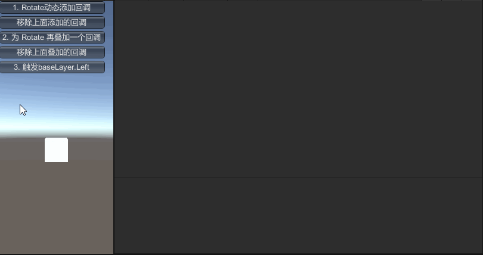
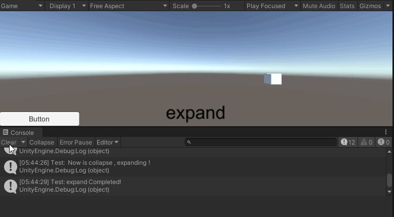

<a id="chinese">[English](#english)</a>

# Unity-MecanimEventSystem

# Animator 事件回调系统

# 简述

这是一个非常实用的，链式编程风格的 Animator 事件系统。

通过 方法扩展 的方式实现了对 Animator 的功能扩展

现在你能直接使用 Animator.SetTarget(clipname,frame) 指定在哪一个动画片段的哪一帧上插入事件。

解决了必须手动插入AnimationEvent的痛点，同时链式+ Lambda 使得逻辑更集中更优雅，也方便阅读和理解。

支持 await/async 语法糖调用,本人仅实现了 [SetBoolAsync](https://github.com/Bian-Sh/Unity-MecanimEventSystem/blob/23785e246062cf70f1f4c3e13bba83344baf0024/Assets/MecanimEventSystem/Runtime/Async/MESCustomAwaiter.cs#L8) ，其他请按需实现即可

插入的事件分2个：

| API         | Description     |
| ----------- | --------------- |
| OnProcess   | 在动画片段用户指定帧执行的回调 |
| OnCompleted | 在动画片段结束帧执行的回调   |

# 使用实例

> * 在中间帧

```
 animator.SetTarget("Left", 55)   //1. 拿到 Animator 引用
    .OnProcess((v) =>             //2. 拆入事件到 55帧 
    {
        string clipname = v.animatorClipInfo.clip.name;       //3.拿到动画片段信息--------片段名称 
        if (v.animatorStateInfo.IsName("Base Layer.Rotate")   //4.拿到动画状态信息--------状态名称 
        {
            Debug.Log("结束时Base Layer：" + clipname + ":" + v.time * v.animatorClipInfo.clip.frameRate); //5. 基于上面的信息做层别以及其他逻辑
        }
        if (v.animatorStateInfo.IsName("New Layer.Rotate1212"))//演示其它层的事件接受
        {
            Debug.Log("结束时New Layer：" + clipname + ":" + v.time * v.animatorClipInfo.clip.frameRate);
        }
    })
    .SetParms("ddsf", objectParm: gameObject) //6. 演示在事件中放置参数，但闭包优势，参数均在上下文，所以可以不设置参数
    .SetTrigger("Left"); // 7. 适配器--适配了Animator API 可以链式操控动画机
```

[示例代码](https://github.com/Bian-Sh/Unity-MecanimEventSystem/blob/23785e246062cf70f1f4c3e13bba83344baf0024/Assets/MecanimEventSystem/Example/AnimClips/EventListener.cs#L10C44-L10C44)

> * 在结束帧

```
 animator.SetTarget("Rotate")
         .OnCompleted((v) =>
         {
            //Do something when finished            
          });
```

[示例代码](https://github.com/Bian-Sh/Unity-MecanimEventSystem/blob/23785e246062cf70f1f4c3e13bba83344baf0024/Assets/MecanimEventSystem/Example/AnimClips/EventListener.cs#L35C53-L35C53)

> * 使用 async / await 

```
    // 这里做一些事情，比如本例中按钮的可交互性改为：false
            button.interactable = false;
            var r = await callbackClps.SetBoolAsync("Expand", false);
            text.text = "collapsed";
    // 这里做一些收尾，比如为 text 赋值 或者 将按钮变为可交互
```

[示例代码](https://github.com/Bian-Sh/Unity-MecanimEventSystem/blob/23785e246062cf70f1f4c3e13bba83344baf0024/Assets/MecanimEventSystem/Example/TestForAwait/Test.cs#L46)

# 动画演示



演示了动态新增事件到动画片段指定帧、叠加事件到同一帧、复用动画片段事件层别（Rotate动画片段复用，通过Layer 输出看到层别效果）



演示了通过 await 实现对流程控制的优雅把控

# todo

1. 将参数内敛到一个类型中并绘制到面板在面板上
2. 将对 EventState 的扩展改为对 Animator 的扩展
3. 整理为 UPM 插件包形式

# 我的简书

[Unity 3D 打造自己的Mecanim Callback System - 简书](https://www.jianshu.com/p/d68b6813c74f) - 仓库逻辑为准

<a id="english">[简体中文](#chinese)</a>

# Unity-MecanimEventSystem

## Animator Event Callback System

### Overview

This is a highly practical, chain-programming style Animator event system that extends the functionality of the Animator through method extensions.

With this system, you can now directly use `Animator.SetTarget(clipname,frame)` to specify which frame of an animation clip to insert an event. This solves the pain point of having to manually insert `AnimationEvents`, while the chain + Lambda approach makes the logic more concentrated, elegant, and easy to read and understand.

The system supports `await/async` syntactic sugar calls. The author has only implemented `SetBoolAsync`, but others can be implemented as needed.

The inserted events are divided into two types:

| API           | Description                                                         |
| ------------- | ------------------------------------------------------------------- |
| `OnProcess`   | Callback executed on the user-specified frame of the animation clip |
| `OnCompleted` | Callback executed on the end frame of the animation clip            |

### Usage Examples

#### In the Middle Frame

```csharp
animator.SetTarget("Left", 55)   // 1. Get Animator reference
    .OnProcess((v) =>             // 2. Insert event at frame 55 
    {
        string clipname = v.animatorClipInfo.clip.name;       // 3. Get animation clip information - clip name 
        if (v.animatorStateInfo.IsName("Base Layer.Rotate")   // 4. Get animation state information - state name 
        {
            Debug.Log("End Base Layer：" + clipname + ":" + v.time * v.animatorClipInfo.clip.frameRate); // 5. Based on the above information, perform layer and other logic
        }
        if (v.animatorStateInfo.IsName("New Layer.Rotate1212"))// Demonstrate event acceptance on other layers
        {
            Debug.Log("End New Layer：" + clipname + ":" + v.time * v.animatorClipInfo.clip.frameRate);
        }
    })
    .SetParms("ddsf", objectParm: gameObject) // 6. Demonstrate placing parameters in events, but due to closure advantages, parameters are in context, so you can not set parameters
    .SetTrigger("Left"); // 7. Adapter - adapted Animator API for chain control of animation machine
```

[Example code](https://github.com/Bian-Sh/Unity-MecanimEventSystem/blob/23785e246062cf70f1f4c3e13bba83344baf0024/Assets/MecanimEventSystem/Example/AnimClips/EventListener.cs#L10C44-L10C44)

#### On the End Frame

```
animator.SetTarget("Rotate")
         .OnCompleted((v) =>
         {
            // Do something when finished            
          });
```

[Example code](https://github.com/Bian-Sh/Unity-MecanimEventSystem/blob/23785e246062cf70f1f4c3e13bba83344baf0024/Assets/MecanimEventSystem/Example/AnimClips/EventListener.cs#L35C53-L35C53)

#### Using async / await

```csharp
// Do something here, such as changing the interactivity of the button in this example to: false
button.interactable = false;
var r = await callbackClps.SetBoolAsync("Expand", false);
text.text = "collapsed";
// Do some finishing touches here, such as assigning values to text or making buttons interactive
```

[Example code](https://github.com/Bian-Sh/Unity-MecanimEventSystem/blob/23785e246062cf70f1f4c3e13bba83344baf0024/Assets/MecanimEventSystem/Example/TestForAwait/Test.cs#L46)

# Animations


Demonstrates the dynamic addition of events to the specified frame of the animation clip, superimposition of events to the same frame, and multiplexing of the animation clip event layer (Rotate animation clip multiplexing, see the layer effect through the Layer output)


Demonstrates the elegant control of process control through await

# To-Do List

1. Inline parameters into a type and draw them on the inspector.
2. Change the extension of ``EventState`` to an extension of ``Animator``.
3. Organize into UPM package form.

# Reference

[Unity 3D 打造自己的Mecanim Callback System - 简书](https://www.jianshu.com/p/d68b6813c74f) - Please follow the logic of the repository.
